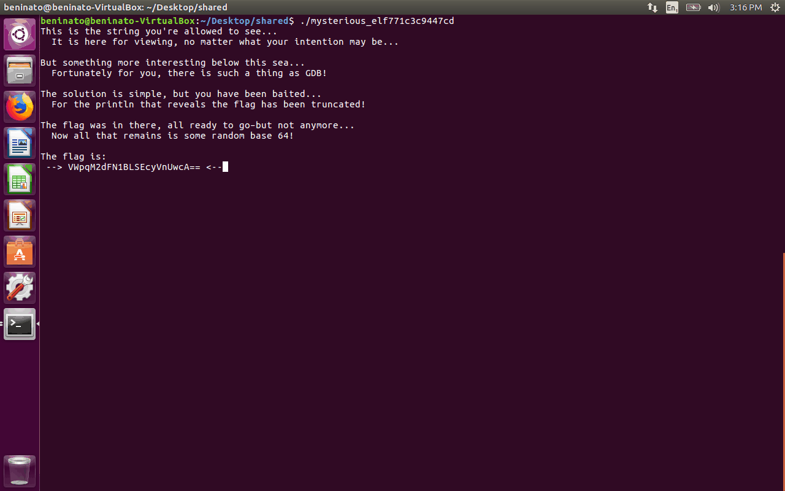

# PACTF 2018 Round 1 Write Up

My first CTF competion!

## A Picture is a Thousand Words (10 points)
 - **Clue**:
Apparently there is something hidden in this [image](A-Picture-is-a-Thousand-Words/image.d25eefefc427.jpg)

 - **Hint**: You’re looking for text—how might you look at the text of the image?

 - **Category**: Steganography

 - 

    
<strong>Solution</strong>:

 
    
    Simple, easy problem to start things off. I first tried [foremost](http://brewformulas.org/Foremost) on the file, but no dice. Next step was to run `strings` on it, and thats it. To get the flag alone, just grep it.

    `strings image.d25eefefc427.jpg | grep flag`

    

 - **Flag**: <!--- flag_is_DjKVIXXQRZZrrAd -->

## Straight From The Emperor (10 points)
 - **Clue**: The Emperor says `ny_nx_tsq3_zumnqq_kwtr_mjwj_6a6b59e767`–what could it possibly mean? I hear that he ‘encrypts’ numbers now too, something about appending them to the alphabet…

 - **Hint**:
Some say he’s an emperor, I say he’s a salad.

 - **Incorrect Flag Hint**: Ask Julius Again...

 - **Category**: Ciphers

 - **Outside resources**: [http://www.rictin.com/caesar](http://www.rictin.com/caesar)

 - 

    
<strong>Solution</strong>:

 

    Looking at this text, you can see its probably some kind of cipher. The underscores look like they split up the words. A common cipher is a [Caesar Cipher](https://en.wikipedia.org/wiki/Caesar_cipher). The hint confirms that, as Caesar is both a salad, and a Roman Emperor. 

    Now that we know the type of cipher, we need a custom alphabet so that the numbers fit in, as a normal Caesar Cipher only has the 26 letters. The clue mentions appending numbers to the alphabet, so we just need to add the numbers to the end of the alphabet for the cipher. The site linked above allows you to have a custom alphabet, so just use the letters in the cipher as your alphabet (abcdefghijklmnopqrstuvwxyz0123456789). Scroll through the answers and one of them makes sense (make your you get your capitalization correct!).

    

 - **Flag**: <!--- it_is_only_uphill_from_here_1516049212 -->

## Caesar Cipher? (20 points)
 - **Clue**: “Cowards die many times before their deaths; the valiant only taste of death but once.” (1007, 1008) Are you valiant enough to figure this out?

    `5:6 1139:4 1620:3 172:4`

 - **Hint**: There’s a lot of text on the Internet and in print. What if you could send messages using all of that data? But you’d have to pick something pretty famous…

 - **Incorrect Flag Hint**: Sorry, that isn't correct! Maybe a classic piece of literature would soothe your psyche...

 - **Category**: Other (Google-fu?)

 - **Outside resources**: [Julius Caesar script](https://www.opensourceshakespeare.org/views/plays/play_view.php?WorkID=juliuscaesar&Scope=entire&pleasewait=1&msg=pl)

 - 

    
<strong>Solution</strong>:

 

    A quick search of the parts of the clue in quotes tells us that it is from Shakespeare's Julius Caesar. Once we know that, it is obvious that the numbers below are line/word numbers. Just find the word on the line for each pair. Easy!

    

 - **Flag**: <!--- Cassius -->

## Let Me In (20 points)
 - **Clue**: You received this [account.rar](Let-Me-In/account.5a52b336da78.rar) file, but it is ‘protected’ under a password. Can you break in?

 - **Hint**: Something tells me the user might not be using complex passwords…

 - **Incorrect Flag Hint**: Keep Cracking...

 - **Category**: Cryptography/Steganography

 - 

    
<strong>Solution</strong>:

 

    This one isn't too hard, it just involves guessing a password. The hint tells us it is a [simple password](https://en.wikipedia.org/wiki/List_of_the_most_common_passwords), so if we try some of these out we get the password, and the text file inside gives us the flag.

    

 - **Flag**: <!--- rgSueiMYehWJSZPZr -->

## Go Git It (25 points)
 - **Clue**: The code samurai (also known by his pseudonym Nicholas) was making some final optimizations on his program when… he accidentally decapitated it.

    Download the samurai’s repository: [go git it.tar.bz2](Go-Git-It/go_git_it.tar.427f1b62f4aa.bz2)

 - **Hint**: Perhaps ‘chopping a branch off a tree’ would be the more precise analogy. 

 - **Category**: Git

 - **Outside resources**: [Git commands](https://git-scm.com/docs)

 - 

    
<strong>Solution</strong>:

    This one might be a little tougher without a knowledge of how to use git. You should have some experience if you've ever submitted an assigment to your repository. 

    The hint tells us we should be [looking in a previous branch of the repo](https://git-scm.com/docs/git-reflog). The interesting commit message that is displayed suggests that we might want to look at the contents commit. If the flag was in there, you might want to see the [differences](https://git-scm.com/docs/git-diff) between the repo now and then, as the flag was probably deleted. To find the flag in all that text, just pipe the output into grep: `git diff [commit hash] | grep flag`

    

 - **Flag**: <!--- 3x3rc1z3_caut10n_wh3n_d3tach1ng_ur_h3ad -->

## Who Said It? (25 points)
 - **Clue**: The clue was just the contents of [this](Who-Said-It/message.txt) file

 - **Hint**: Keys live on keyservers.

 - **Category**: Cryptography

 - **Outside resources**: 

 - [GPG](https://releases.gpgtools.org/GPG_Suite-2018.1.dmg)
 - [Public Key Server](https://pgp.mit.edu/)

 - 

    
<strong>Solution</strong>:

 

    The problems are starting to get a little bit tougher now. You are given a PGP message and the signature. You can assume that you probably want the key that signed the message, as the hint tells you that keys live on keyservers. The MIT key server is a good place to look, as it is a common place to store public keys. In order to find a key, however, [the server needs](https://pgp.mit.edu/extracthelp.html) a KeyID. To get an ID from a PGP message and signature, we can use GPG. [This](https://security.stackexchange.com/a/63079) SO answer explains how to get a public key from a signature. So, if we run `gpg -vv` (-vv is extra verbose), we can now paste in the message and signature. And, right at the end, we can see a KeyID! Just throw that at the keyserver, and you get the flag (just make sure to read the [instructions](https://pgp.mit.edu/) for how to extract a key)

    If you want to show off your bash skills, you can redirect stdin and stdout to use the message as your input, and then pass all the output to grep to get your id, and then dump the rest in the trash

    `gpg -vv < message.txt 2> >(grep 'key ID') >/dev/null`

    

 - **Flag**: <!--- the_real_answer_is_always_in_the_comments -->

## Bad Melody (30 points)
 - **Clue**: Our musician friend Martin recently bought a melody pack containing different melodies recorded in MIDI format. He hoped to Outside resources, he only received one MIDI file. It sounded awful, and Martin quickly noticed why!

    Can you notice why?

    See for yourself: [melody.mid](Bad-Melody/melody.4f1964921e6a.mid)

 - **Hint**: How would you edit MIDI?

 - **Incorrect Flag Hint**: No :( Why should Martin not buy melody packs?

 - **Category**: Steganography

 - 

    
<strong>Solution</strong>:

 

    This might be the easiest one. Just open the midi file.

    

 - **Flag**: <!--- WRITE YOUR OWN MUSIC -->

## Open Sourcery 2018 (30 points)
 - **Clue**: The solution to this problem lies within the Chromium source code. Literally. There is some string in there that mentions a flag and PACTF…

 - **Hint**: This problem builds off of a similarly named problem in PACTF 2017.

 - **Incorrect Flag Hint**: Keep searching, we're in there somewhere!

 - **Category**: Other 

 - **Outside resources**:

     - [Chromium Code Search](https://cs.chromium.org/)
     - [Chromium Repository](https://github.com/chromium/chromium)

 - 

    
<strong>Solution</strong>:

 

    So, you could try searching all that source code on your own with chromium's own search page, or, if you have an extra few gigs to spare, just clone their repo and grep all that for pactf. No need to spend any time on a problem if your laptop can do it while you get a snack.

    All you need to do is recursively (I made it case insensitive just to be thorough as well) grep the chromium repo, and then search that output for 'flag' 

    `grep -i -r "pactf" . | grep flag`

    

 - **Flag**: <!--- pactf-flag-4boxdpa21ogonzkcrs9p.com -->

## Credit Card Leak (35 points)
 - **Clue**: ShoeShop was hacked, and all of their customer records were released online—including credit card numbers. One credit card in the leak is invalid, however. What is the invalid credit card number?

    Here’s the leak: [cc_leak.txt.bz2](Credit-Card-Leak/cc_leak.txt.eecc6f896436)

 - **Hint**: The credit card numbers in the leak are obviously all invalid, but most would pass a certain credit card validity test. All credit card numbers except one, that is.

 - **Category**: Scripting

 - 

    
<strong>Solution</strong>:

 

    This is another simple one. The defacto "credit card validity check" is the [Luhn Algorithm](https://en.wikipedia.org/wiki/Luhn_algorithm). So write a script that checks all the numbers.

    Psuedo code:

        def passes_luhn_check(int num):
            # implement luhn algorithm
            # return boolean

        file = open('ccnums.txt')
        for ccnum in file:
            if not passes_luhn_check(ccnum):
                print(ccnum)

    

 - **Flag**: <!--- 8692015931457397 -->

## Third Eye (40 points)
 - **Clue**: Sometimes​‌‌‌​‌‌‌​‌‌​ there‌​​​​‌‌​​​​‌ is ​‌‌‌​‌​​​‌​‌‌‌more ‌‌​‌‌​​‌​‌​‌‌​‌‌​​​‌‌‌​​‌‌​‌‌​​‌​‌​‌​‌‌‌‌‌​‌‌​‌‌​​​‌‌‌​‌​‌​‌‌‌​​‌​​‌‌​‌​‌‌​‌‌‌​​‌‌​‌​‌‌‌‌‌​‌‌​​​‌than ​​‌‌​​‌​‌​‌‌​‌‌meets ‌​​‌‌​​‌​‌​‌‌​​​the ​‌​‌‌‌​‌​​​‌‌​‌​​​​‌​‌‌‌‌‌​‌‌‌eye​‌​​​‌‌​‌​​​​‌‌​​‌​‌​‌​‌‌‌‌‌​‌‌​​‌​‌​‌‌‌‌​​‌​‌‌​​‌​‌.

 - **Hint**: Maybe if you just squint harder…

 - **Category**: Web

 - **Outside resources**:

    - You are on the [PACTF website](https://2018.pactf.com/game/Lovelace/). [Here](./Game-PACTF.htm) is a local copy.
    - [https://codepen.io/chriscoyier/pen/iLKwm](https://codepen.io/chriscoyier/pen/iLKwm)
 - 

    
<strong>Solution</strong>:

    There are 2 types of zero width characters hidden in the clue. If you swap them out for 1s and 0s you get the flag in binary. You can either use the site above or go to Inspect Element > Edit as HTML to get the characters.

    

 - **Flag**: <!--- what_else_lurks_beneath_the_eye -->

## Getting to Know GDB (50 points)
 - **Clue**: A friend sent me a [mysterious binary](/Getting-to-Know-GDB/mysterious_elf771c3c9447cd). It’s supposed to print out the flag, but it’s giving me a weird poem and some hex instead.

 - **Hint**: The flag is *in there somewhere*, but something gives me the feeling that searching the binary for strings wont help…

 - **Category**: Binaries

 - **Outside resources**: [Hopper](https://hopperapp.com)

 - 
 
    
<strong>Solution</strong>:

    If you run the program, this is the result:
    

        
    

    I couldn't figure out how to get GDB to run on Mac, and I couldn't figure out how to use it on my Ubuntu VM. However, I was able to use Hopper to find the answer in the disassembled code. If you open the binary with Hopper, you can see an interesting item in the strings section. If you view the references to that string (right click it), you can see the assembly code instructions, and their are some hex values underneath that string that look to be in the range of ASCII characters...

    Thanks to [adbforlife](https://github.com/adbforlife) for telling me to look under the string for the rest of the flag.
    

 - **Flag**: <!--- why_use_breakpoints_if_you_have_good_timing -->

## Security Through Obscurity? (50 points)
 - **Clue**: We intercepted this message, but we can’t make heads or tails of it. It was rattled off so fast, too… How could anyone be that good at using a cipher?

    Anyway, here’s the message. Good luck!

    `Tązhii, Łį́į́ʼ, Dzeeh Mąʼii, Dibé yázhí, Wóláchííʼ, Tłʼízí Tin, Dibé Mósí, Łį́į́ʼ, Dzeeh, Dibé, Tązhii, Dzeeh, Gah, Neeshchʼííʼ, Dzeeh, Béésh dootłʼizh`

 - **Hint**: This definitely doesn’t look like English. What else could it be? Perhaps looking through the history books might help…

 - **Incorrect Flag Hint**: No dice! Nada! Nil! Falsa! Erroné!

 - **Category**: Ciphers

 - **Outside resources**: [This](https://gist.github.com/TheZ3ro/572ef81c0f20bf9c4c435b32a62a7056) gist

 - 

    
<strong>Solution</strong>:

    
    At a first glance, it looks like this is some foreign language. The clue and hint both suggest a historical context, and a famous language used to "encrypt" messages was Navajo, which was used by the [US military during WWII](https://en.wikipedia.org/wiki/Code_talker#Navajo_code_talkers). Even if you didn't know the historical significance, you could just for the ciphertext, and the first result gives you a [gist](https://gist.github.com/TheZ3ro/572ef81c0f20bf9c4c435b32a62a7056) to decode the message

    

 - **Flag**: <!--- CHESTERNEZ -->

## Beats by Dr. K (55 points)
 - **Clue**: Dr. K just released her new EP — download her [track](Beats-by-Dr-K/bits.675c46a10049.wav) now!

 - **Hint**: Listen to each bit…

 - **Incorrect Flag Hint**: Well, at least this piece has some nice bits...

 - **Category**: Steganography

 - **Outside resources**: [Sonic Visualizer](https://www.sonicvisualiser.org/)

 - 

    
<strong>Solution</strong>:

    This one was a little trickier than the previous ones. Running some common audio steg tools on the wav yielded zilch, so I needed to find another approach. When I applied a spectrogram to the wav file, it looked a little different than that of a normal song. The resulting image looked a bit... barcodish. However, it wasn't the right size/clarity to scan it, so it must be something else. What else could an image of 2 different colored strips be? Binary, perhaps? After more than a view translation errors, the flag was able to be found.

    

 - **Flag**: <!--- pactfmusic -->

## The Lottery, Part One: Spill Your Heart Out! (65 points)
 - **Clue**: I was playing [this](Lotter-1/output.81ed5b400225) lottery. Which number is going to win next time? If only you could see into the future…

 - **Hint**: Brought to you by *Oracle Corporation!* Spill your heart out!

 - **Incorrect Flag Hint**: My heart remains closed off...

 - **Category**: Scripting/Algorithmns

 - 

    
<strong>Solution</strong>:

    
    I figured out the second lottery before this one, and in my research, I found [this](https://jazzy.id.au/2010/09/20/cracking_random_number_generators_part_1.html) site. If this problem was anything like the previous one, I was going to have to exploit a flaw in Java's PRNG using only 2 numbers. Given the infomation from the aforementioned, a quick search turned up [this](https://github.com/fta2012/ReplicatedRandom/blob/master/ReplicatedRandom.java#L23) script, which gives you the answer.

    

 - **Flag**: <!--- -632232200 -->

## The Lottery, Part Two: Untwisting Fate! (90 points)
 - **Clue**: This time the lottery is harder than ever! Can you manage to untwist the cockles of fate itself? Can you see into the future?

    [They seem to have given me a lot more information. Perhaps it’ll help?](Lottery-2/output.9327e404be0e)

 - **Hint**: We may regard the present state of the universe as the effect of its past and the cause of its future. An intellect which at a certain moment would know all forces that set nature in motion, and all positions of all items of which nature is composed, if this intellect were also vast enough to submit these data to analysis, it would embrace in a single formula the movements of the greatest bodies of the universe and those of the tiniest atom; for such an intellect nothing would be uncertain and the future just like the past would be present before its eyes. — Pierre Simon Laplace, A Philosophical Essay on Probabilities

 - **Incorrect Flag Hint**: Fate remains untwisted! Is there any way to master random chance itself...

 - **Category**: Scripting/Algorithmns

 - **Outside resources**:

    - [MT19937 PRNG Predictor](https://github.com/kmyk/mersenne-twister-predictor)
    - [Useful explanation and stuff](https://jazzy.id.au/2010/09/22/cracking_random_number_generators_part_3.html)

 - 

    
<strong>Solution</strong>:

    This one left me stumped for quite a while, but I got a lucky break when Vivian send me a [screenshot](Lottery-2/keeton.png) of Keeton's story, where he posted all I needed to know to solve this problem. This problem is based on exploiting a flaw in Python's RNG, which uses the [Mersenne Twister](https://en.wikipedia.org/wiki/Mersenne_Twister) to generate numbers. Without using Keeton's help, you were supposed to figure this out by the word "twister" in the title/clue, and knowing how Python's random module works. Luckily for me, Keeton provided the exact name of a program that would work for me, but a quick search for a Mersenne Twister Predictor will also let you find it. Simply run the script as suggested in the README, and you're good to go.

    

 - **Flag**: <!--- 3956993139 -->

## Siblings (120 points)
 - **Clue**: One 4096-bit RSA key is impossible to break, so 20 must be even better! By chaining each encryption together, surely it’s impossible for you to figure out what the message is?

    [Everything you’ll need (except the private keys, you’re on your own for that!)](Siblings/problem-data.e34ba61084c2.zip)

 - **Hint**: Numbers don’t have siblings, right? What could that mean?

 - **Incorrect Flag Hint**: None

 - **Category**: Cryptography

 - **Outside resources**:

    - [Tutorial](https://www.youtube.com/watch?v=sYCzu04ftaY)
    - [Wikipedia](https://en.wikipedia.org/wiki/RSA_(cryptosystem)#Operation)
    - [Pycrypto](https://www.dlitz.net/software/pycrypto/)

 - 

    
<strong>Solution</strong>:

    
    Now this was a fun one! Heading into it, I knew absolutely nothing about RSA or any sort of encryption. To start of, I watched the youtube video a couple times. It does a great job explaining everything you need to know, and it is in the context of CTF as well. I reccomend watching the *whole* thing, not just skimming through. Once I had an idea of what I needed to do, I wrote a python script to factor the public keys by finding the gcds between them. Using PyCrypto, I was able to get n, p, q, e, and d for each public key, which let me find the private keys. I then used openssl to decrypt the ciphertext using each key, and after the last one, you get the flag. If you are still confused, I highly recommend watching the youtube video. It explains everything that you need to know to get started.

    Special thanks to my Russian friend [Alex](https://github.com/loqpa) for showing me the youtube video
    

 - **Flag**: <!--- t00 many c00ks sp0il the br0th -->
